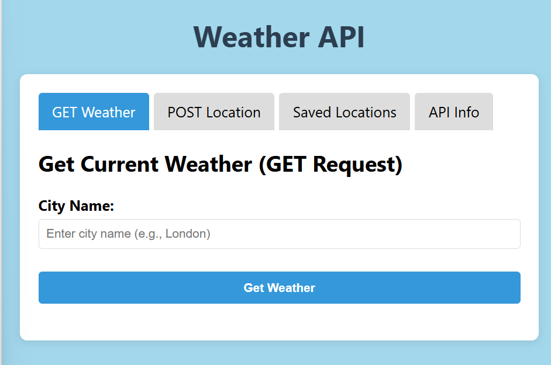

# Weather API Web Application

A front-end web application that interacts with OpenWeatherMap API to fetch weather data and demonstrates RESTful API operations (GET, POST, PUT, DELETE).

## Features

- **Tab-based navigation** for different functionalities
- **Real-time weather data** from OpenWeatherMap API
- **CRUD operations** for location management (using JSONPlaceholder mock API)
- **API request/response logging**
- Responsive UI with clean design

## API Integrations

### OpenWeatherMap API (GET)
- Fetches current weather data by city name
- Displays:
  - Temperature (°C)
  - Weather conditions
  - Humidity
  - Wind speed

### JSONPlaceholder API (POST/PUT/DELETE)
- Simulates backend operations for:
  - Saving new locations
  - Updating existing locations
  - Deleting locations

## Technical Implementation

### Frontend Structure
- **HTML**: Semantic structure with tabs and forms
- **CSS**: Responsive design with cards and modals
- **JavaScript**:
  - `fetch()` API for all requests
  - Dynamic DOM manipulation
  - Error handling

### Key Functions
| Function | Description |
|----------|-------------|
| `getWeather()` | Fetches weather data |
| `saveLocation()` | Creates new location |
| `deleteLocation()` | Removes location |
| `updateLocation()` | Modifies location |
| `renderSavedLocations()` | Displays saved locations |
| `displayResponseInfo()` | Logs API activity |

## Setup Instructions

1. Clone this repository
2. Open `index.html` in a browser
3. Get a free API key from [OpenWeatherMap](https://openweathermap.org/api)
4. Replace `WEATHER_API_KEY` in `script.js`

## Limitations

- JSONPlaceholder doesn't persist data (mock backend)
- No user authentication
- Basic weather metrics only (no forecasts)

## Future Improvements

- [ ] Add real backend (Firebase/Node.js)
- [ ] Implement user authentication
- [ ] Include 5-day weather forecast
- [ ] Add local storage caching
- [ ] Improve mobile responsiveness

## API Documentation

- [OpenWeatherMap API Docs](https://openweathermap.org/api)
- [JSONPlaceholder Guide](https://jsonplaceholder.typicode.com/)

---

